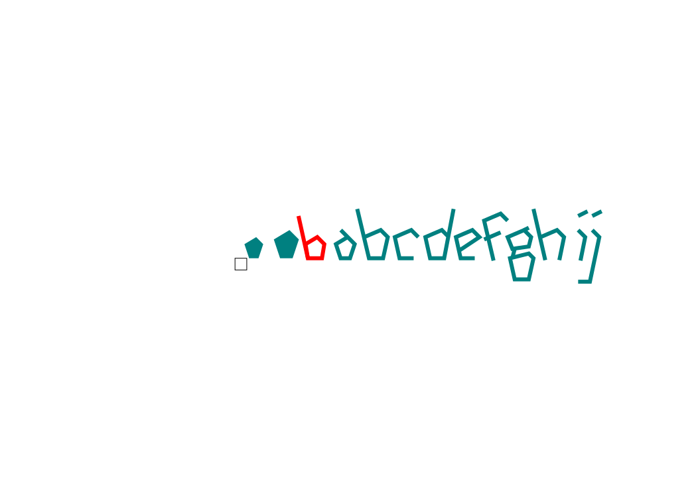

# Typography Ideas

In the past I had a lot of free time and very few social commitments, and my days off were spend in cafes writing and sketching ideas for lettering. When I discovered vector graphics via Inkscape, I set to work converted the best ideas into SVG files, shared here.

## Known Issues

Each typeface is a work in progress, but I figure half-baked ideas are better than none. 😉

### What I'd like to do next

- standardized backgrounds
- standardized sizes
- example text for each
- complete sets of Latin-1 characters
  - caps are not my forte 😆

## Contribute

Got free time? I'd love to hear constructive feedback. Please post an issue.

## Samples

### altenbeuthen

### art-deco-al-amsaar

### bedrock

### custodian

### eggtimer

### froggy

### gentsuki

### kanazawa

### kashiwa2

### Markus2

### marquee_short

### polygons

### squiggle2

### three-to-four

### torque

